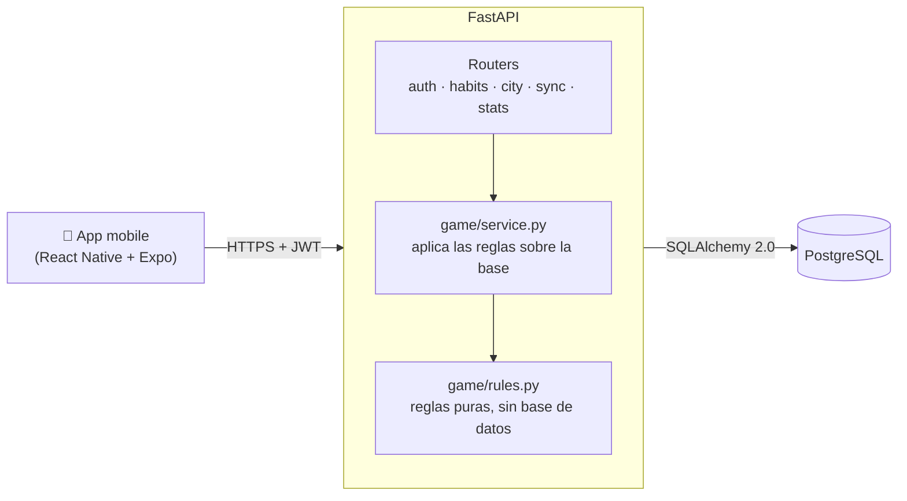
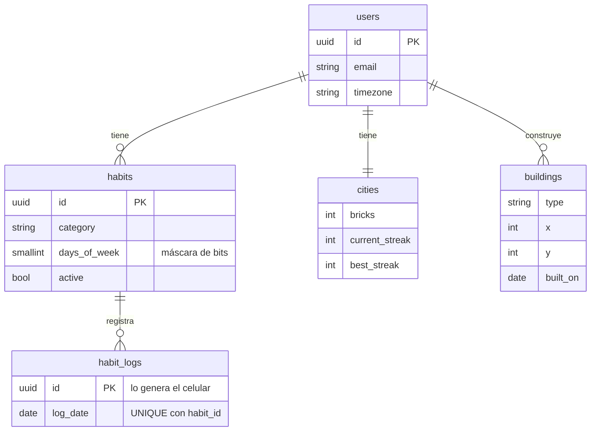

# 🏙️ Crea

**Construí tu ciudad, construí tu mejor versión.**

Crea es una app de hábitos donde tu progreso deja de ser un número: cada hábito que cumplís suma ladrillos, y cada día completo levanta un edificio nuevo en tu ciudad. Si cortás la racha, la obra se frena.

Este repo contiene la **API** del proyecto. La app mobile (React Native + Expo) está en desarrollo.


---

## 🎮 Cómo funciona el juego

| Acción | Resultado |
|---|---|
| Cumplís un hábito | **+10 ladrillos** |
| Cumplís todos los hábitos del día | Se construye un edificio según la categoría que más cumpliste |
| 7 días de racha | 🗼 Torre especial |
| 30 días de racha | 🏙️ Rascacielos |
| Desmarcás un hábito y el día queda incompleto | Se quita el edificio de ese día |

Cada categoría construye algo distinto, así la ciudad refleja quién sos:

| Categoría | Edificio |
|---|---|
| `EXERCISE` | 🏋️ Gimnasio |
| `READING` | 📚 Biblioteca |
| `SAVINGS` | 🏦 Banco |
| `MEDITATION` | 🌳 Parque |
| `OTHER` | 🏠 Casa |

Los edificios se ubican en **espiral desde el centro**, así la ciudad crece hacia afuera de forma prolija. Los días sin hábitos programados (por ejemplo, fines de semana) no suman a la racha, pero tampoco la cortan.

---

## 🏗️ Arquitectura



### Decisiones de diseño

- **El servidor manda en la lógica del juego.** La app solo avisa "cumplí este hábito"; el backend decide cuántos ladrillos suma, si se completó el día y qué se construye. Así nadie hace trampa editando la app.
- **Reglas puras y testeables.** `game/rules.py` no depende de la base de datos: rachas, edificios y posiciones se testean con funciones simples, sin levantar nada.
- **"Hoy" depende del usuario.** El día se calcula con la zona horaria de cada usuario, no la del servidor. Si no, a alguien de México se le cortaría la racha a las 21 h.
- **Antitrampa simple.** Solo se puede marcar hoy o ayer (un día de gracia), nunca fechas viejas.
- **Offline first.** El celular genera el UUID de cada registro. Si reenvía el mismo lote, la restricción `UNIQUE (habit_id, log_date)` evita duplicados, así sincronizar es seguro aunque se corte la conexión.

---

## 📡 Endpoints

La documentación interactiva (Swagger) queda en `http://localhost:8000/docs`.

| Método | Endpoint | Descripción |
|---|---|---|
| `POST` | `/auth/register` | Registro (crea la ciudad vacía del usuario) |
| `POST` | `/auth/login` | Login, devuelve un JWT |
| `GET` | `/auth/me` | Datos del usuario autenticado |
| `GET` `POST` | `/habits` | Listar y crear hábitos |
| `PUT` `DELETE` | `/habits/{id}` | Editar y archivar |
| `PUT` | `/habits/{id}/logs/{fecha}` | Marcar como cumplido (idempotente) |
| `DELETE` | `/habits/{id}/logs/{fecha}` | Desmarcar |
| `GET` | `/today` | Hábitos de hoy, racha y ladrillos |
| `GET` | `/city` | Ciudad completa para dibujar |
| `GET` | `/city/timeline` | Edificios en orden de construcción (para el timelapse) |
| `POST` | `/sync` | Sube en lote lo marcado sin conexión |
| `GET` | `/stats?from=&to=` | Cumplimiento, rachas, desglose por categoría y por día |

Al marcar un hábito, la respuesta dice qué pasó en el juego, así la app sabe qué animación mostrar:

```json
{
  "bricks_earned": 10,
  "day_completed": true,
  "streak": 7,
  "new_buildings": [
    { "type": "LIBRARY", "x": -1, "y": -1, "built_on": "2026-09-28" },
    { "type": "TOWER", "x": 0, "y": -1, "built_on": "2026-09-28" }
  ],
  "removed_buildings": 0
}
```

---

## 🗄️ Modelo de datos



---

## 🚀 Cómo correrlo

**Requisitos:** Python 3.11+ y PostgreSQL.

1. Clonar el repo y crear el entorno virtual:
   ```bash
   git clone https://github.com/ipiseradev/Crea.git
   cd Crea
   python -m venv venv
   source venv/Scripts/activate   # Windows (Git Bash)
   # source venv/bin/activate     # macOS / Linux
   pip install -r requirements.txt
   ```

2. Crear la base de datos y sus tablas:
   ```bash
   psql -U postgres -c "CREATE DATABASE crea;"
   psql -U postgres -d crea -f db/schema.sql
   ```

3. Configurar las variables de entorno:
   ```bash
   cp .env.example .env
   ```
   Completar `DATABASE_URL` con tus credenciales y `JWT_SECRET` con un texto aleatorio de 32 caracteres o más.

4. Levantar la API:
   ```bash
   python -m uvicorn app.main:app --reload
   ```
   Y entrar a `http://localhost:8000/docs`.

---

## 🧪 Tests

```bash
pytest
```

32 tests que cubren las reglas del juego (rachas, días de descanso, edificios especiales, espiral), la autenticación, el flujo completo de hábitos, la sincronización offline y las estadísticas. Corren contra SQLite en memoria, sin tocar tu base real.

---

## 📁 Estructura

```
app/
├── auth/       → registro, login y JWT
├── habits/     → CRUD de hábitos, marcar/desmarcar y pantalla del día
├── game/       → reglas del juego (rules.py) y su aplicación (service.py)
├── sync/       → sincronización offline en lote
├── stats/      → estadísticas
├── models.py   → tablas mapeadas con SQLAlchemy
└── main.py
db/
└── schema.sql  → script de creación de las tablas
tests/
```

---

## 🗺️ Roadmap

- [x] API: autenticación, hábitos, lógica del juego, sincronización offline y estadísticas
- [ ] App mobile con React Native + Expo
- [ ] Ciudad isométrica animada
- [ ] Notificaciones de recordatorio
- [ ] Timelapse de la ciudad para compartir
- [ ] Deploy

---

Hecho por **Ignacio Pisera** · [LinkedIn](https://www.linkedin.com/in/ignacio-pisera) · [GitHub](https://github.com/ipiseradev)
